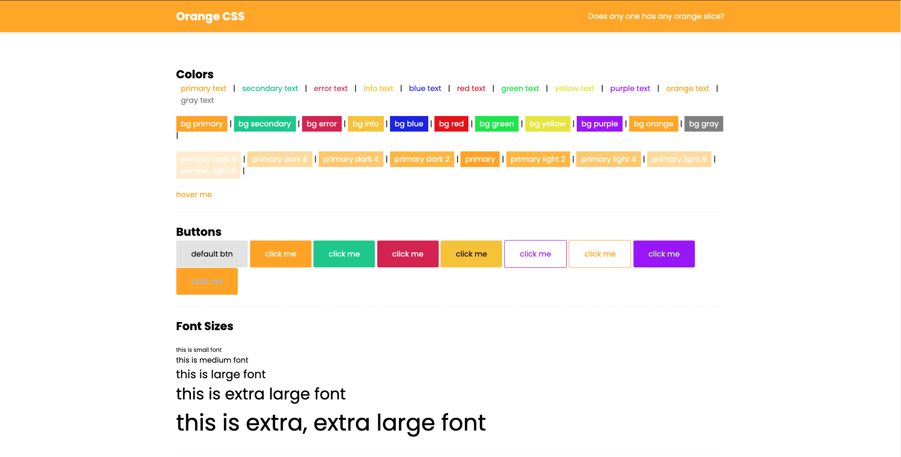
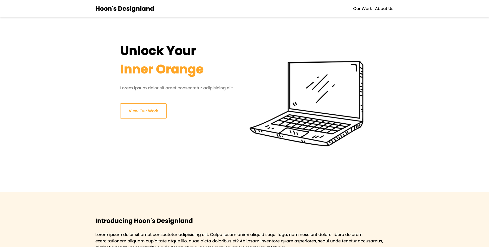

# Orange - for Scott
Simple Sass/Scss example project learning from [The Net Ninja's SASS Tutorial.](https://www.youtube.com/watch?v=_kqN4hl9bGc&list=PL4cUxeGkcC9jxJX7vojNVK-o8ubDZEcNb)

## Run yourself
To generate CSS, run this command.
```bash
$ gulp
```
You should install [Gulp](https://gulpjs.com/) to use this.

## Features
- [x] Made with Sass/Scss and Gulp 
- [x] Class-oriented syntax like TailwindCSS
- [x] Responsiveness & Grid System included
- [x] Purge unused class
- [x] Customizable from `/sass` folder

## Screenshots
| Design System | Sample Webpage |
|--------------------|------------------|
|  |  |
